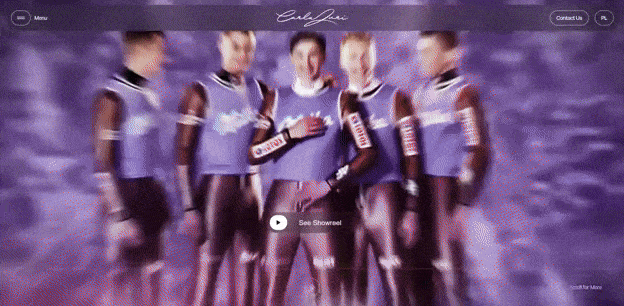
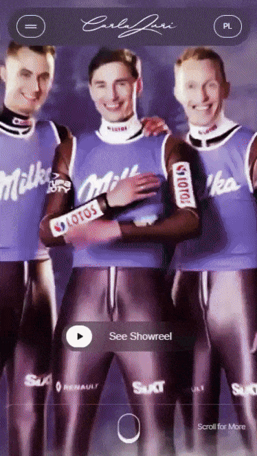

# [Carla Zuri Website](https://carlazuri.com)

  
  

The project exhibits the creative agency's core strengths through beautifully designed pop-ups showcasing a collection of its case studies. It's a fully responsive single-page website compliant with core web accessibility principles. In addition to its visually appealing design, the website boasts impressive performance metrics.

- 🎨 A modern single-page website for Carla Zuri developed using React and TypeScript to showcase the brand and its services.
- ✨ Created engaging user interactions with smooth animations and transitions powered by React Transition Group.
- 🏆 Optimized for peak performance, ensuring fast loading times and excellent user experience across all devices.
- ⚡ Implemented server-side rendering for enhanced SEO performance and improved initial page load speeds.
- ♿ Prioritized accessibility standards, implementing React Focus Trap for seamless keyboard navigation and screen reader compatibility.
- 📱 Crafted responsive design using Sass for maintainable styling and pixel-perfect layouts across all screen sizes.

_Developed @ Sarigato_
