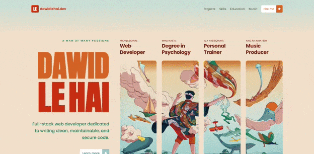
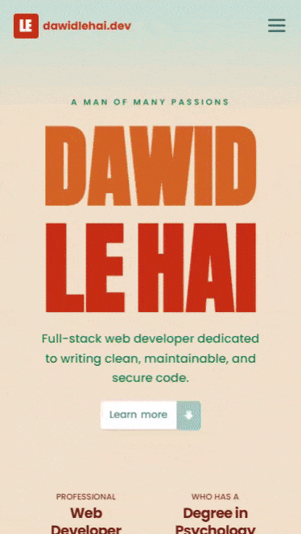

# [My Former Portfolio](https://saitama-personal.netlify.app)

  
  

My former personal portfolio website that showcases my skills and projects, built with Astro and TypeScript. It features a clean design and responsive layout.

- 🚀 Leveraged Astro's static site generation for lightning-fast performance and optimal loading speeds across all pages.
- ⚛️ Integrated React components selectively for interactive elements while maintaining Astro's performance benefits through partial hydration.
- 🎯 Crafted professional presentation of my work, skills, and experience with clean design and intuitive navigation.
- 📱 Ensured responsive design, providing an excellent viewing experience across all devices and screen sizes.
- 🔧 Built with type safety using TypeScript for robust code quality and better development experience.
- 💅 Styled with custom CSS for pixel-perfect design control and optimized performance without heavy framework overhead.

_Designed and developed by Dawid Le Hai_

