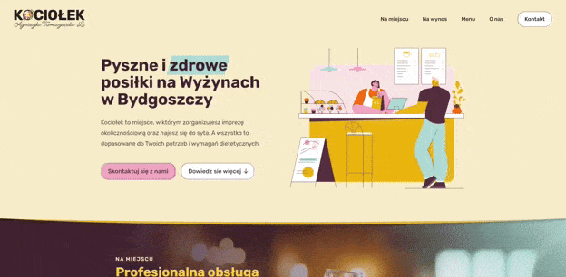
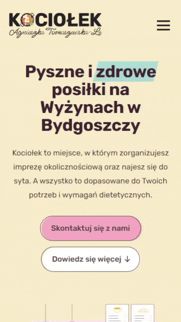

# [Kociołek Website](https://kociolekbydgoszcz.pl)

  
  

For this freelance project, I took complete ownership of the design and development process to craft an online presence that resonated with the unique charm of the cafe. I shaped everything from the brand colors and logo to graphics, photos, and appealing fonts.

By focusing on performance optimization and responsive web design, I achieved an exceptional Lighthouse score, providing a smooth browsing experience across all devices. Furthermore, implementing best SEO practices significantly boosted the cafe's online visibility.

- 🍽️ A complete digital presence for the local restaurant.
- ⚡ Implemented hybrid architecture using Remix with server-side rendering for initial load, then seamless SPA navigation for optimal user experience.
- 🏆 Achieved exceptional Lighthouse scores across all categories (performance, accessibility, best practices, and SEO) through careful optimization.
- 🔍 Optimized for search engines with server-side rendering, ensuring excellent SEO performance and discoverability for the local business.
- 📱 Crafted a fully responsive design that provides an excellent dining experience across all devices, from mobile to desktop.
- 🎨 Designed a cohesive brand experience combining visual design with technical implementation to reflect the bistro's local charm and character.

_Designed and developed by Dawid Le Hai_

