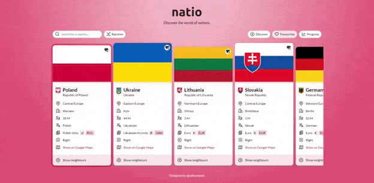
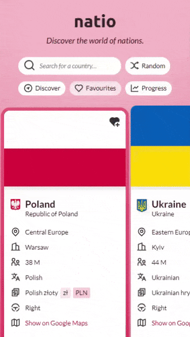

# [Natio](https://saitama-natio.netlify.app/)

  
  

Single-page application designed from scratch that explores countries and their neighbors, saves favorites, and tracks discovery progress. It follows the MVC architecture, pulls data from the REST Countries API, and features a responsive design. The background changes dynamically based on each country's flag, and a custom search makes finding countries easy.

- 🌍 A comprehensive country information app developed using vanilla JavaScript and REST Countries API to explore world geography and data.
- 🔍 Implemented full search functionality allowing users to discover countries, view detailed information, and explore neighboring nations.
- ⭐ Added interactive features, including favorites system, discovery tracking, and random country selection for enhanced user engagement.
- 📱 Ensured full responsiveness with a mobile-optimized design that works seamlessly across all devices and screen sizes.
- 🎨 Designed and developed solo, handling both UI/UX design and technical implementation from concept to completion.
- 🌐 Integrated REST Countries API for real-time country data, population statistics, and geographical information.
- 💡 Gained valuable framework appreciation through the challenges of building a SPA without modern development frameworks.

_Designed and developed by Dawid Le Hai_
