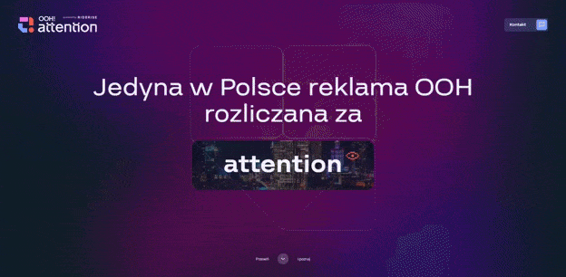
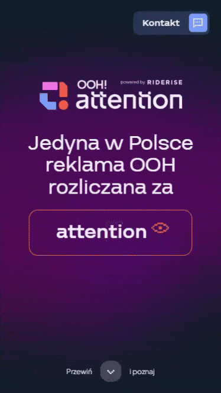

# [OOH!attention Website](https://oohattention.com)

_Developed @ Sarigato_

Showcase of an innovative out-of-home solution, a first-of-its-kind in Poland. Despite the complex design, I successfully delivered a fast-loading and fully responsive website within a tight deadline. The project highlights two dynamic shapes that animate as you scroll through the page, along with mesmerizing orbs in the hero section.

- 🎯 Single-page website with a focus on striking visual impact and creative presentation.
- ⚡ Developed rapidly under tight deadlines while maintaining high visual standards and engaging user experience.
- ✨ Created captivating animations using GSAP for dynamic interactions and smooth visual transitions throughout the site.
- 🌊 Implemented smooth scrolling experience with Lenis for fluid navigation and enhanced user engagement.
- 📱 Ensured responsive design, adapting layouts and interactions across different screen sizes and devices.
- ⚙️ Utilized modern build tools with Vite for a fast development workflow and efficient bundling.

